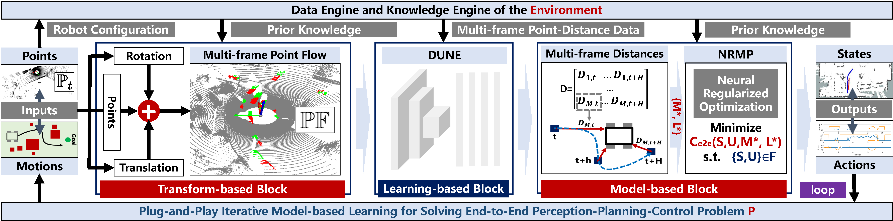

# NeuPAN: Direct Point Robot Navigation with End-to-End Model-based Learning

| **[`PDF_Arxiv`](https://arxiv.org/pdf/2403.06828.pdf)** | **[`Video_Youtube`](https://youtu.be/SdSLWUmZZgQ)** |**[`Video_Bilibili`](https://www.bilibili.com/video/BV1Zx421y778/?vd_source=cf6ba629063343717a192a5be9fe8985)** | 



## Code
Our paper is currently under review. The code will be released upon acceptance.


## Citation

If you find our work helpful in your research, please consider citing:

```bibtex

@article{han2024neupan,
  title={NeuPAN: Direct Point Robot Navigation with End-to-End Model-based Learning},
  author={Han, Ruihua and Wang, Shuai and Wang, Shuaijun and Zhang, Zeqing and Chen, Jianjun and Lin, Shijie and Li, Chengyang and Xu, Chengzhong and Eldar, Yonina C and Hao, Qi and Pan, Jia},
  journal={arXiv preprint arXiv:2403.06828},
  year={2024}
}

```


