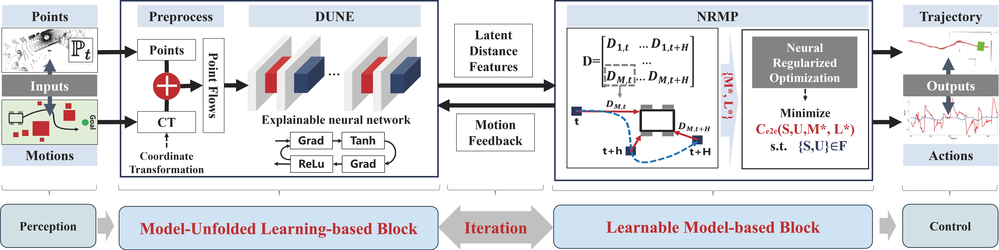

<div align="center">

# NeuPAN: Direct Point Robot Navigation with End-to-End Model-based Learning

<a href="https://ieeexplore.ieee.org/abstract/document/10938329"></a>
<a href="https://arxiv.org/pdf/2403.06828.pdf"></a>
<a href="https://youtu.be/SdSLWUmZZgQ"></a>
<a href="https://www.bilibili.com/video/BV1Zx421y778/?vd_source=cf6ba629063343717a192a5be9fe8985"></a>
<a href="https://hanruihua.github.io/neupan_project/"></a>
<a href="https://github.com/hanruihua/neupan_ros"></a>

</div>

## News

- **2025-12-25**: 🎉 Our NeuPAN planner is integrated into the [odin-nav-stack](https://github.com/ManifoldTechLtd/Odin-Nav-Stack) project, feel free to try it out! 
- **2025-04-24**: 🎯 We provide the python 3.8 compatible NeuPAN version available on [py38](https://github.com/hanruihua/NeuPAN/tree/py38) branch. 
- **2025-03-26**: 🎯 Available on [IEEE Transactions on Robotics](https://ieeexplore.ieee.org/abstract/document/10938329). 
- **2025-03-25**: 🔓 Code released! 
- **2025-02-04**: 🎉 Our paper is accepted by **T-RO 2025!**  

## Introduction

**NeuPAN** (Neural Proximal Alternating-minimization Network) is an **end-to-end**, **real-time**, **map-free**, and **easy-to-deploy** MPC based robot motion planner. By integrating learning-based and optimization-based techniques, **NeuPAN directly maps obstacle points data to control actions in real-time** by solving an end-to-end mathematical model with numerous point-level collision avoidance constraints. This eliminates middle modules design to avoid error propagation and achieves high accuracy, allowing the robot to navigate in cluttered and unknown environments efficiently and safely.

## Why using NeuPAN

| Aspect | Traditional Modular Planners (TEB, DWA) | End-to-End Learning-based Planners (RL, IL) | **NeuPAN** |
| ------ | --------------------------------------- | -------------------------------- | ---------- |
| **Architecture** | Modular pipeline with object detection, mapping, and planning | End-to-end policy network | ✅ **End-to-end** framework without middle modules, avoiding error propagation |
| **Environment Handling** | Limited by map representation and object models | Depends on training environments | ✅ **Directly processes obstacle points**, handles cluttered/unstructured environments with arbitrary shaped objects |
| **Training Data** | N/A (rule-based) | Requires huge amount of real/simulated data | ✅ **Minimal training data**: simply random points within a certain range |
| **Training Time** | N/A (rule-based) | Hours to days on GPU clusters | ✅ **Fast training**: 1-2 hours on CPU for new robot geometry |
| **Retraining** | N/A | Often requires retraining for new environments | ✅ **Train once** for robot geometry, apply to various environments without retraining |
| **Safety Guarantee** | Relies on accurate perception | No formal safety guarantee | ✅ **Mathematical optimization** with collision avoidance constraints for reliable deployment |
| **Deployment** | Complex integration required | Black-box policy, hard to debug | ✅ **Easy to deploy** and flexible to integrate with global planners (A*, VLN) |

## Demonstrations

More real world demonstrations are available on the [project page](https://hanruihua.github.io/neupan_project/).

https://github.com/user-attachments/assets/7e53b88c-aba9-4eea-8708-9bbf0d0305fc

https://github.com/user-attachments/assets/e37c5775-6e80-4cb5-9320-a04b54792e0e

https://github.com/user-attachments/assets/71eef683-a996-488f-b51b-89e149d0cc6e



## Prerequisite
- Python >= 3.10

## Installation

```
git clone https://github.com/hanruihua/NeuPAN
cd NeuPAN
pip install -e .  
```

## Run Examples on IR-SIM

Please Install [IR-SIM](https://github.com/hanruihua/ir-sim) first by:

```
pip install ir-sim
```

You can run examples in the [example](https://github.com/hanruihua/NeuPAN/tree/main/example) folder to see the navigation performance of `diff` (differential), `acker` (ackermann) and `omni` (Omnidirectional) robot powered by NeuPAN in IR-SIM. Scenarios include:

- `convex_obs` (convex obstacles)
- `corridor` (corridor)
- `dyna_non_obs` (dynamic nonconvex obstacles)
- `dyna_obs` (dynamic obstacles)
- `non_obs` (nonconvex obstacles)
- `pf` (path following)
- `pf_obs` (path following with obstacles)
- `polygon_robot` (polygon robot)
- `reverse` (car reverse parking)
- [dune training](https://github.com/hanruihua/NeuPAN/tree/main/example/dune_train)
- [LON training](https://github.com/hanruihua/NeuPAN/tree/main/example/LON) 

Some demonstrations run by `run_exp.py` are shown below:

|     ```python run_exp.py -e non_obs -d acker```        | ```python run_exp.py -e dyna_non_obs -d acker```    |
| :-------------------------------------------------------------------------------------------------------------------------------------------------------------: | :----------------------------------------------------------------------------------------------------------------------------------------------------------: |
| **```python run_exp.py -e polygon_robot -d diff```**   | **```python run_exp.py -e dyna_obs -d diff -v```**  |  |
|   **```python run_exp.py -e corridor -d acker```**     |  **```python run_exp.py -e corridor -d diff```**    |
|   **```python run_exp.py -e dyna_non_obs  -d omni```**     |  **```python run_exp.py -e dyna_obs -d omni```**    |

> [!NOTE]
> *The pretrained DUNE model provided in these examples are trained under the size of the robot. If you adjust the size of the robot, you must retrain the DUNE model by referring to the [DUNE Training]([#dune-model-training-for-your-own-robot](https://github.com/hanruihua/NeuPAN/tree/main/example/dune_train)) example.*

> [!NOTE]
> *Since the optimization solver cvxpy is not supported on GPU, we recommend using the CPU device to run the NeuPAN algorithm. Thus, the hardware platform with more powerful CPU (e.g. Intel i7) is recommended to achieve higher frequency and better performance. However, you can still use the GPU device to train the DUNE model for acceleration.*

## YAML Parameters

Since there are quite a lot of parameters setting for the Neupan planner, we provide a YAML file to initialize the parameters in NeuPAN, which is listed below:

| Parameter Name        | Type / Default Value | Description                                                                          |
| --------------------- | -------------------- | ------------------------------------------------------------------------------------ |
| `receding`            | `int` / 10           | MPC receding steps.                                                                  |
| `step_time`           | `float` / 0.1        | MPC time step (s).                                                                   |
| `ref_speed`           | `float` / 4.0        | MPC reference speed (m/s).                                                           |
| `device`              | `str` / "cpu"        | The device to run the planner.  `cpu` or `cuda`                                      |
| `time_print`          | `bool` / False       | Whether to print the time cost of forward step (s).                                  |
| `collision_threshold` | `float` / 0.1        | The threshold for collision detection (m).                                           |
| `robot`               | `dict` / dict()      | The parameters for the robot. See 'robot' section.                                   |
| `ipath`               | `dict` / dict()      | The parameters for the naive initial path. See 'ipath' section.                      |
| `pan`                 | `dict` / dict()      | The parameters for the proximal alternating minimization network. See 'pan' section. |
| `adjust`              | `dict` / dict()      | The parameters for the adjust weights. See 'adjust' section.                         |
| `train`               | `dict` / dict()      | The parameters for the DUNE training. See 'train' section.                           |

**`robot` section**:

| Parameter Name | Type / Default Value                       | Description                                                                                                    |
| -------------- | ------------------------------------------ | -------------------------------------------------------------------------------------------------------------- |
| `kinematics`   | `str` / "diff"                             | The kinematics of the robot. `diff` for differential drive, `acker` for Ackermann drive, `omni` for omni drive. For `diff` robot, the output action is linear and angular speed. For `acker` robot, the output action is linear speed and steering angle. For `omni` robot, the output action is speed in x and y direction.                      |
| `vertices`     | `list[list[float]]` / None                 | The vertices of the robot in the initial state. `[[x1, y1], [x2, y2], ...]`                                    |
| `max_speed`    | `list[float]` / [inf, inf]                 | The maximum speed of the robot. For `diff`: [max_linear_speed, max_angular_speed]. For `acker`: [max_linear_speed, max_steering_angle]. For `omni`: [max_linear_speed, max_angular_speed]. Note: Although the `omni` output action is `vx` and `vy`, we still use max_linear_speed and max_angular_speed to make the motion more stable                                                                            |
| `max_acce`     | `list[float]` / [inf, inf]                 | The maximum acceleration of the robot. For `diff`: [max_linear_acceleration, max_angular_acceleration]. For `acker`: [max_linear_acceleration, max_steering_acceleration]. For `omni`: [max_linear_acceleration, max_angular_acceleration].                                                                               |
| `wheelbase`    | `float` / None                             | The wheelbase of the robot. Generally set for the ackermann robots.                                            |
| `length`       | `float` / None                             | The length of the robot. If the `vertices` is not given, this parameter is required for rectangle robot simply |
| `width`        | `float` / None                             | The width of the robot.  If the `vertices` is not given, this parameter is required for rectangle robot simply |
| `name`         | `str` / kinematics + "_robot" + '_default' | The name of the robot. Used for saving the DUNEmodel.                                                          |

**`ipath` section**:

| Parameter Name           | Type / Default Value                       | Description                                                                                                  |
| ------------------------ | ------------------------------------------ | ------------------------------------------------------------------------------------------------------------ |
| `waypoints`              | `list[list[float]]` / None                 | The waypoints of the path. `[[x1, y1, theta1], [x2, y2, theta2], ...]`                                                       |
| `loop`                   | `bool` / False                             | When robots arrive at the last waypoint, whether the path will be reset to the beginning.                    |
| `curve_style`            | `str` / `line`                             | The style of the curve. `dubins` for Dubins' path, `reeds` for Reeds-Shepp's path. `line` for straight line. |
| `min_radius`             | `float` / default_turn_radius of the robot | The minimum radius of the curve.                                                                             |
| `interval`               | `float` / ref_speed * step_time            | The interval of the points in the path, it is recommended to be set less than or equal to the ref_speed * step_time.                                                                      |
| `arrive_threshold`       | `float` / 0.1                              | The threshold to judge whether the robot arrives at the target.                                              |
| `close_threshold`        | `float` / 0.1                              | The threshold to judge the closest point on the path to the robot.                                           |
| `ind_range`              | `int` / 10                                 | The index range of the waypoints, used for finding the next reference point on the path.                     |
| `arrive_index_threshold` | `int` / 1                                  | The threshold of the index to judge whether the robot arrives at the target.                                 |

**`pan` section**:

| Parameter Name    | Type / Default Value | Description                                                                                          |
| ----------------- | -------------------- | ---------------------------------------------------------------------------------------------------- |
| `iter_num`        | `int` / 2            | The number of iterations. Large number could guarantee convergence but with high computational cost. |
| `dune_max_num`    | `int` / 100          | The maximum number of obstacle points considered in the DUNE layer.                                  |
| `nrmp_max_num`    | `int` / 10           | The maximum number of obstacle points considered in the NRMP layer.                                  |
| `dune_checkpoint` | `str` / None         | The checkpoint model path of the DUNE model.                                                         |
| `iter_threshold`  | `float` / 0.1        | The threshold to judge whether the iteration converges.                                              |

**`adjust` section**:

*You may adjust the parameters in the `adjust` section to get better performance for your specific workspace.*

| Parameter Name | Type / Default Value | Description                                                                                                                                                                                  |
| -------------- | -------------------- | -------------------------------------------------------------------------------------------------------------------------------------------------------------------------------------------- |
| `q_s`          | `float` / 1.0        | The weight for the state cost. Large value encourages the robot to follow the initial path closely.                                                                                          |
| `p_u`          | `float` / 1.0        | The weight for the speed cost. Large value encourages the robot to follow the reference speed.                                                                                               |
| `eta`          | `float` / 10.0       | Slack gain for L1 regularization.                                                                                                                                                            |
| `d_max`        | `float` / 1.0        | The maximum safety distance.                                                                                                                                                                 |
| `d_min`        | `float` / 0.1        | The minimum safety distance.                                                                                                                                                                 |
| `ro_obs`       | `float` / 400        | The penalty parameters for collision avoidance. Smaller value may require more iterations to converge.                                                                                       |
| `bk`           | `float` / 0.1        | The associated proximal coefficient for convergence.                                                                                                                                         |
| `solver`       | `str` / "ECOS"       | The optimization solver method for the NRMP layer. See [cvxpylayers](https://github.com/cvxgrp/cvxpylayers) and [cvxpy](https://www.cvxpy.org/tutorial/solvers/index.html) for more details. |

## DUNE Model Training for Your Own Robot with a Specific Convex Geometry

To train a DUNE model for your own robot with a specific convex geometry, you can refer to the [example/dune_train](https://github.com/hanruihua/NeuPAN/tree/main/example/dune_train) folder. Specifically, the convex geometry is defined in the `robot` section by the `vertices` (or `length` and `width` for rectangle) when the robot is in the initial state (coordinate origin). The training parameters can be adjusted in the `train` section. Generally, the training time is approximately 1-2 hours for a new robot geometry.

You can use the `train` section in YAML file to set the training parameters for the DUNE model. The parameters are shown below:

**`train`** section:

| Parameter Name | Type / Default Value               | Description                                                               |
| -------------- | ---------------------------------- | ------------------------------------------------------------------------- |
| `direct_train` | `bool` / True                      | Whether to directly train the DUNE model without asking for confirmation. |
| `model_name`   | `str` / robot_name                 | The name of the model for file saving.                                           |
| `data_size`    | `int` / 100000                     | The size of the generated training data.                                            |
| `data_range`   | `list[float]` / [-25, -25, 25, 25] | The `[x_min, y_min, x_max, y_max]` range of the generated training data (meter). If your robot will consider the obstacle points outside this range, you must set a larger value. |
| `batch_size`   | `int` / 256                        | The batch size for training.                                              |
| `epoch`        | `int` / 5000                       | The number of epochs for training.                                        |
| `valid_freq`   | `int` / 100                        | The frequency of the validation.                                          |
| `save_freq`    | `int` / 500                        | The frequency of saving the model.                                        |
| `lr`           | `float` / 5e-5                     | The learning rate for training.                                           |
| `lr_decay`     | `float` / 0.5                      | The decay rate for the learning rate.                                     |
| `decay_freq`   | `int` / 1500                       | The frequency of the learning rate decay.                                 |
| `save_loss`    | `bool` / False                     | Whether to save the loss to file.                                         |

> [!NOTE]
> The DUNE model only needs to be trained once for a new robot geometry. This trained model can be used in various environments without retraining.

## ROS Wrapper

We provide a ROS wrapper for NeuPAN. You can refer to the [neupan_ros](https://github.com/hanruihua/neupan_ros) repo to see the details. The Gazebo demonstrations are shown below:


https://github.com/user-attachments/assets/1d5eb028-0d22-4741-8899-40a3ea7caab4


## Notes for Real World Deployment

- You can easily deploy the NeuPAN algorithm on a real robot platform using [neupan_ros](https://github.com/hanruihua/neupan_ros). Currently, NeuPAN supports the kinematics of differential drive robots, Ackermann robots and omni-directional robots (see the `robot` section in the YAML file). For robots with other kinematics, you can modify the constraints in the NRMP layer to suit your needs.

- The DUNE model trained in simulation can be directly applied in the real world without retraining.

- NeuPAN solves the mathematical optimization problem in real time. Thus, its performance is influenced by three main factors: 1) the computing power of the CPU-based hardware platform; 2) the adjustment of the parameters in the `adjust` section; and 3) the naive initial path provided by the user.

- We recommend using a hardware platform with a powerful CPU to enable NeuPAN to run at a control frequency higher than 10 Hz. You can run the provided examples to observe the forward time cost of NeuPAN. To reduce this cost, adjust parameters such as `receding`, `nrmp_max_num`, `dune_max_num`, `iter_num`, and `iter_threshold` to make NeuPAN run faster. In our experience, an Intel i7 CPU is capable of running NeuPAN at a control frequency higher than 15 Hz.

- The `adjust` parameters are used to tune the weights of the state cost, speed cost, and collision avoidance cost. These parameters influence NeuPAN's behavior, making it either more aggressive or more conservative. You can adjust or train these parameters to achieve better performance for your specific workspace. Additionally, these parameters can be fine-tuned in real time for different scenarios.

- The naive initial path can be generated from the provided waypoints or derived from a global planner like A* without accounting for obstacles. This path serves as a simple, rough initial guess for NeuPAN. We offer functionality to generate the initial path from given waypoints as either:
  - direct lines for differential drive robots,
  - Dubins' paths for forward Ackermann vehicles, or
  - Reeds-Shepp paths for forward and backward Ackermann vehicles.


## Current Limitations

- **CPU-bound optimization**: The NRMP layer uses cvxpy which does not support GPU acceleration, so inference speed depends on CPU performance.
- **Supported kinematics**: Currently limited to differential drive, Ackermann, and omnidirectional robots. Other kinematics require modifying the NRMP constraints.
- **Convex robot geometry**: The DUNE model assumes convex robot shapes. Non-convex robots need to be approximated by convex hulls.
- **Parameter tuning**: Performance in specific environments may require tuning the `adjust` parameters for optimal results.

## FAQ:

### Can I use 3D lidar or other sensors such as camera to run this algorithm?

Yes. NeuPAN algorithm is designed to read the 2D points as obstacles to avoid. You can use any sensors to get these points and feed them to NeuPAN. For 3D lidar, you can convert the 3D points to 2D space by projecting them onto the ground plane (e.g., [pointcloud_to_laserscan](http://wiki.ros.org/pointcloud_to_laserscan)); For camera, you can extract the 2D points from the camera image. 

### How to run NeuPAN on my own robot with a specific kinematics?

Currently, NeuPAN only supports the kinematics of differential drive robots (`diff`), Ackermann robots (`acker`) and omni-directional robots (`omni`). If you want to use other kinematics, you can modify the [kinematic constraints](https://github.com/hanruihua/NeuPAN/blob/main/neupan/robot/robot.py#L188) in the NRMP layer to suit your needs. We also welcome contributions to support more kinematics by PR or issues. You can test the performance in the ir-sim environments.

### When should I retrain the DUNE model? 

You only need to retrain the DUNE model when you change the robot size or shape. Except that, changing the sensors or the scenarios will not influence the performance of the DUNE model. 

### What is the most important parameter to train DUNE?

Before training the DUNE model, you should confirm the robot geometry (vertices or length and width for rectangle) in the `robot` section is correct. Additionally, `data_range` in train section is also important, which is decided by the maximum range of the obstacle points you want to consider.

### How can I integrate NeuPAN with other global planners such as A*?

You can update the initial path from other global planners in real time by the function [set_initial_path](https://github.com/hanruihua/NeuPAN/blob/main/neupan/neupan.py#L286C9-L286C25). For neupan_ros, you can use the topic `/initial_path` and set the `refresh_initial_path` to be True to read the initial path from other global planners.

*If there are any technical issues, please feel free to open an issue or contact me (hanrh@connect.hku.hk). Contributions to make this project better are also welcome.*

## License

This project is licensed under the [GNU General Public License v3.0](LICENSE).

## Citation

If you find this code or paper is helpful, please kindly star :star: this repository and cite our paper by the following BibTeX entry:

```bibtex
@ARTICLE{10938329,
  author={Han, Ruihua and Wang, Shuai and Wang, Shuaijun and Zhang, Zeqing and Chen, Jianjun and Lin, Shijie and Li, Chengyang and Xu, Chengzhong and Eldar, Yonina C. and Hao, Qi and Pan, Jia},
  journal={IEEE Transactions on Robotics}, 
  title={NeuPAN: Direct Point Robot Navigation With End-to-End Model-Based Learning}, 
  year={2025},
  volume={41},
  number={},
  pages={2804-2824},
  doi={10.1109/TRO.2025.3554252}}
```


